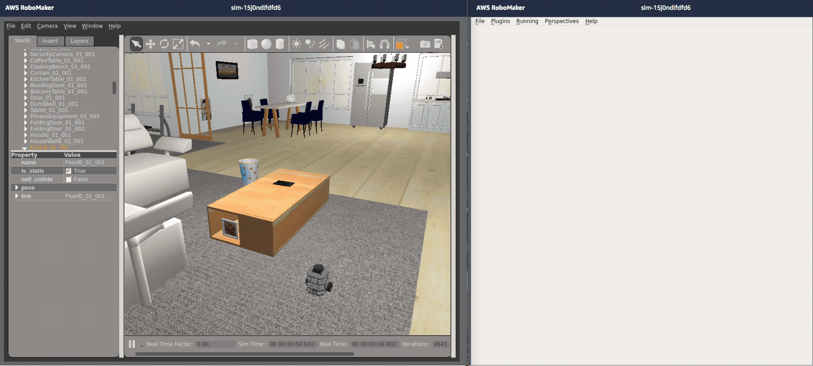
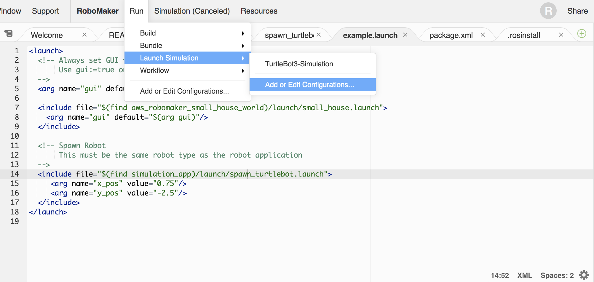
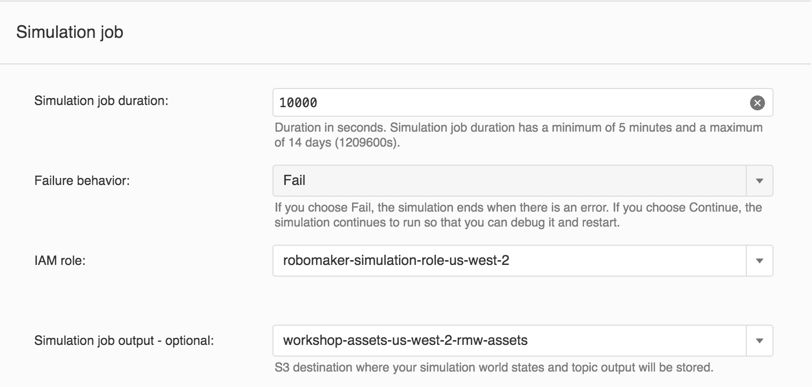
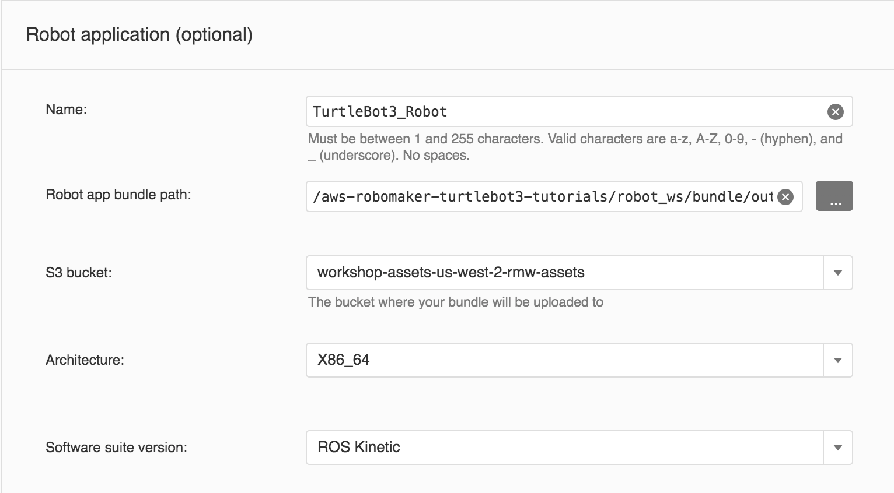
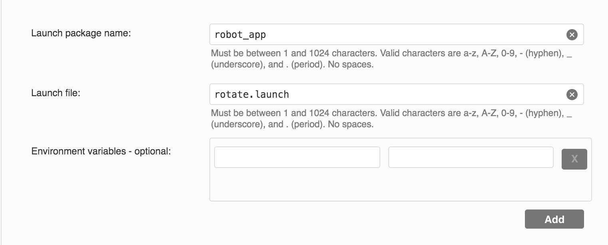
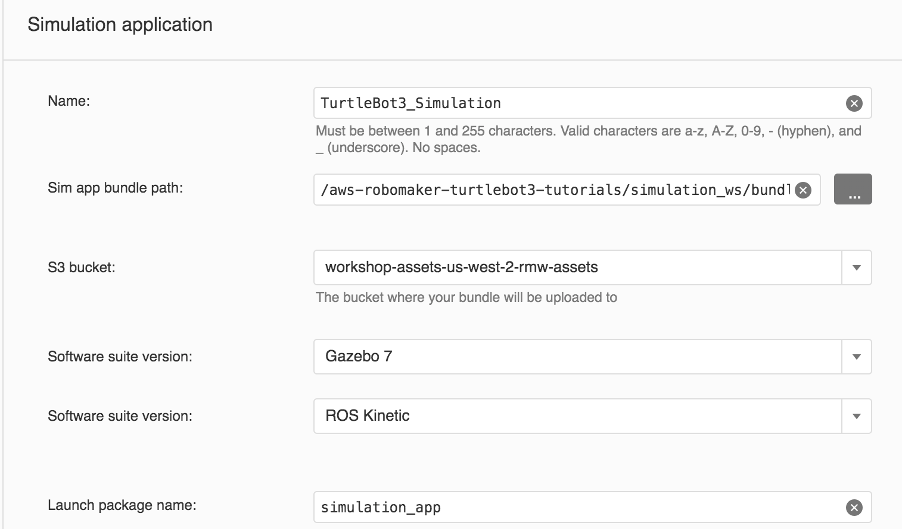
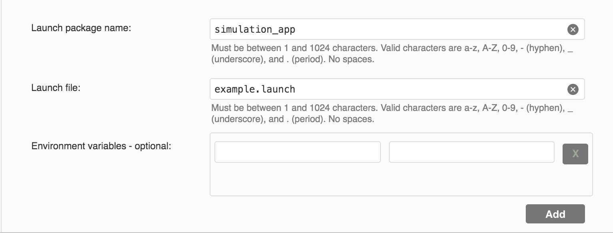
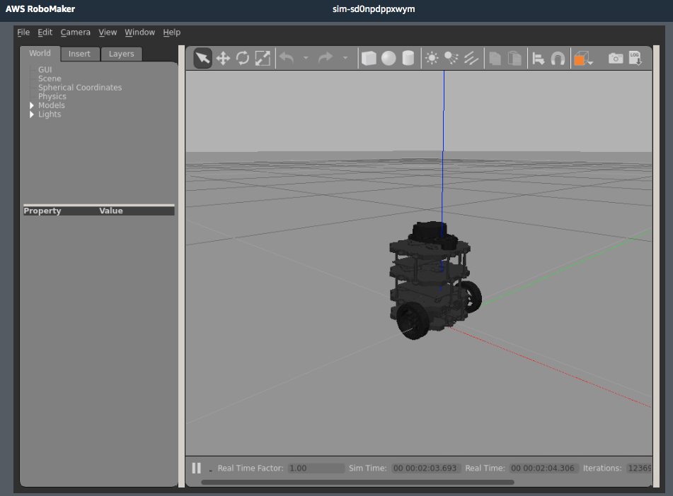
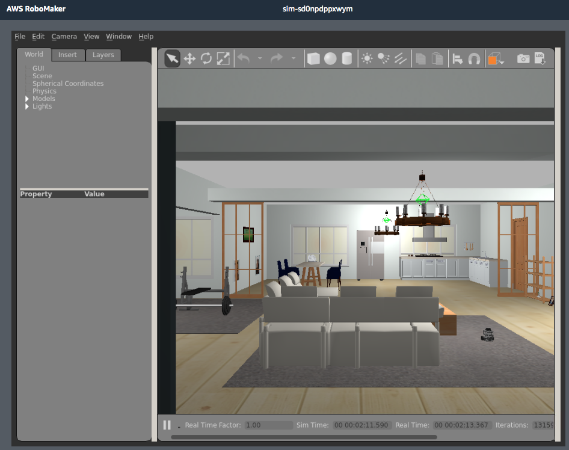

# aws-robomaker-turtlebot3-tutorials

http://ccoss.org Workshop



¿Qué es AWS RoboMaker?

AWS RoboMaker es un servicio que facilita la creación de aplicaciones de robótica a escala. AWS RoboMaker amplía el marco de ROS (Robot Operating System) con los servicios en la nube. Esto incluye los servicios de aprendizaje automático de AWS. También incluye los servicios de monitorización. Incluso incluye los servicios de análisis. Todo ello se combina para permitir que un robot realice por sí mismo diversas acciones, como transmitir datos en streaming, comunicarse, interpretar datos y aprender. AWS RoboMaker proporciona un entorno de desarrollo de aplicaciones de robótica. Proporciona un servicio de simulación de robótica que agiliza las pruebas de las aplicaciones. Proporciona un servicio de administración de flotas que permite implementar y administrar aplicaciones de forma remota.


# Primera Parte: Desarollar y probar un robot en simulación con AWS RoboMaker

1) Crea un Entorno de Desarollo en la consola de AWS RoboMaker. Nombralo: TurtleBot3 y elije ROS Kinetic 

2) Empieza por clonar este repositorio en una linea de comandos desde Cloud9 IDE

```
git clone https://github.com/cbuscaron/aws-robomaker-turtlebot3-tutorials.git
```

3) Vaya al directorio robot_ws, a continuación, ejecute los siguientes comandos:

```
rosdep update
rosdep install --from-paths src --ignore-src -r -y
colcon build
colcon bundle
```

4) Vaya al directorio simulation_ws y ejecute los siguientes comandos:

```
rosdep update
rosdep install --from-paths src --ignore-src -r -y
colcon build
colcon bundle
```

## Configura el lanzamiento de trabajos de simulacion

Run -> Launch Simulation -> Add or Edit Configurations



Complete los siguientes parametros con la los siguientes nombre:

```
Name: TurtleBot3-Simulation
Simulation job duration: 1000
```







5) Lanza la simulacion

Run-> Launch Simulation -> TurtleBot3-Simulation



## Agregar el mundo de la casa en simulacion

1) Crea el siguiente archivo en el folder de simulation_ws/.rosinstall y agrega la siguiente linea:
```
# simulation_ws/.rosinstall

- git: {local-name: src/aws_robomaker_small_house_world, uri: 'https://github.com/aws-robotics/aws-robomaker-small-house-world', version: v0.0.1}
```

2) Abre example.launch en simulation_ws/simulation_app/launch y modificalo con los siguientes parametros:

```
<launch>
  <!-- Always set GUI to false for AWS RoboMaker Simulation
       Use gui:=true on roslaunch command-line to run with a gui.
  -->
  <arg name="gui" default="false"/>
  
  <include file="$(find aws_robomaker_small_house_world)/launch/small_house.launch">
    <arg name="gui" default="$(arg gui)"/>
  </include>

  <!-- Spawn the turtlebot in simulation at (x,y) -->
  <include file="$(find explore_simulation)/launch/spawn_turtlebot.launch">
     <arg name="x_pos" value="0.75"/>
     <arg name="y_pos" value="-2.5"/>
   </include>
</launch>
```
4) Vaya al directorio simulation_ws y ejecute los siguientes comandosen el cli:

```
rosdep update
rosdep install --from-paths src --ignore-src -r -y
colcon build
colcon bundle
```
5) Lanza la simulacion

Run-> Launch Simulation -> TurtleBot3-Simulation



Inspeciona y mueve el robot dentro de la casa


Finalmente lanza la ventana de rqt y controla el robot


# Segunda Parte: Navegar y explorar autonomamente en simulación con AWS RoboMaker

```
  <depend>turtlebot3_slam</depend>
  <depend>turtlebot3_navigation</depend>
  <exec_depend>slam_gmapping</exec_depend>
```

```
export TURTLEBOT3_MODEL=burger
roslaunch turtlebot3_slam turtlebot3_slam.launch slam_methods:=gmapping open_rviz:=false
```

```
rosrun map_server map_saver -f ~/map
```

```
roslaunch turtlebot3_navigation turtlebot3_navigation.launch map_file:=$HOME/map.yaml open_rviz:=false
```

# Tercera Parte: Desplegar codigo a un robot con AWS RoboMaker administración de robots 

