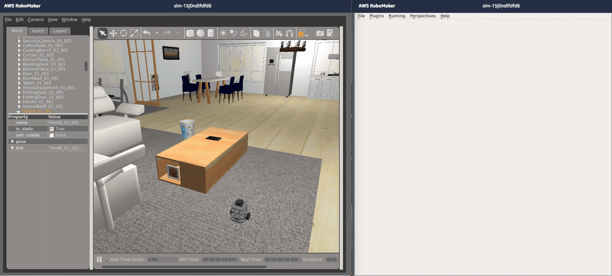

# aws-robomaker-turtlebot3-tutorials

http://ccoss.org Workshop

¿Qué es AWS RoboMaker?

AWS RoboMaker es un servicio que facilita la creación de aplicaciones de robótica a escala. AWS RoboMaker amplía el marco de ROS (Robot Operating System) con los servicios en la nube. Esto incluye los servicios de aprendizaje automático de AWS. También incluye los servicios de monitorización. Incluso incluye los servicios de análisis. Todo ello se combina para permitir que un robot realice por sí mismo diversas acciones, como transmitir datos en streaming, comunicarse, interpretar datos y aprender. AWS RoboMaker proporciona un entorno de desarrollo de aplicaciones de robótica. Proporciona un servicio de simulación de robótica que agiliza las pruebas de las aplicaciones. Proporciona un servicio de administración de flotas que permite implementar y administrar aplicaciones de forma remota.

# Primera Parte: Desarollar y probar un robot en simulación con AWS RoboMaker

# Segunda Parte: Navegar y xplorar autonomamente en simulación con AWS RoboMaker

# Tercera Parte: Desplegar codigo a un robot con AWS RoboMaker administración de robots 

